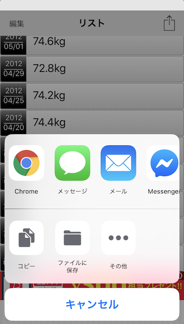

# healthKitWeight

## はじめに

ソフトバンクからリリースされている [お父さん体重記録帳](https://www.softbank.jp/mobile/service/otosan-app/) で記録した体重データをヘルスヘアアプリに移行するためのソースコードです。

## 使い方

アプリよりファイルに保存やメールに添付するなどして、エクスポートしてください。  
エクスポートしたファイル **database.weightlog** をプロジェクトに取り込んでください。

## 参考サイト

* [体重データのHealthStoreへの読み書き](http://docs.fabo.io/swift/healthkit/002_healthkit.html)
* [plistからデータを読み込む swift 3.0](https://qiita.com/Saayaman/items/1f1da4abab61b7465a13)
* [【Swift】Dateの王道 【日付】](https://qiita.com/rinov/items/bff12e9ea1251e895306)
* [[Apple Watch] 30分で作るヘルスケアWatchOS App](https://qiita.com/sato-shin/items/1a6859d854b754fff85b)
